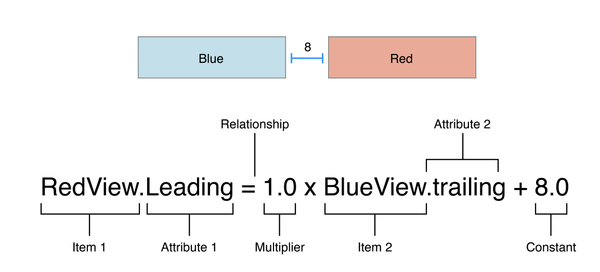
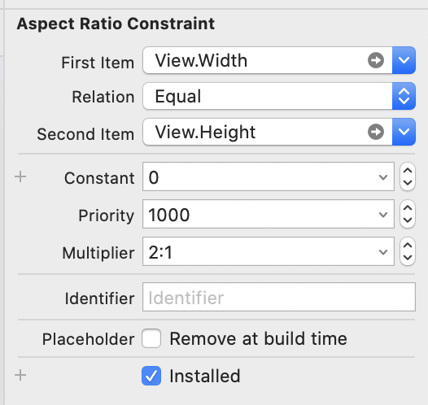
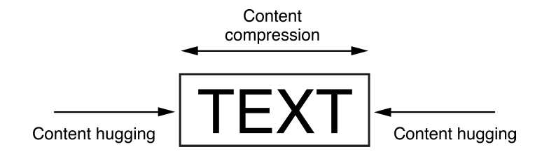

# Autolayout - Apple documentation


- AutoLayout의 필요성에 대해서!!!
  - External Change & Internal Change
  - AutoLayout vs FrameLayout
- 제약조건에 대해서
  - 제약조건 알아보기
  - 직접 해보기 (Interface Builder에서 작업) 


----

## External Change & Internal Change

오토레이아웃이 왜 필요할까? 두가지 이유가 있어요~!

### External Change (외부 변경)

핸드폰의 사이즈는 너무나 다양합니다... 벌써 아이폰12가 출시 예정이고, 아이패드 맥OS 등등.. 애플리케이션 하나를 만들 때마다 모든 기기의 화면을 고려해줘야 합니다. 이럴 때 하나하나 기기마다 레이아웃을 설정해주는 건 귀찮지만 그 작업을 기계가 대신해줍니다!!!  또한, 기기가 회전할 때, 창 크기를 조절할 때, 등등 외적으로 변경될 때마다 레이아웃을 다시 맞춰야합니당

### Internal Change (내부 변경)

사용자가 애플리케이션을 사용하면서 인터페이스 내의 View들을 만질 때 발생하는 변경사항들이 있습니다. 아래와 같은 경우입니다. 

- 앱에 표시되는 콘텐츠 변경! - 콘텐츠(뉴스 등)들은 매번 업데이트 될 때마다 텍스트, 이미지들의 크기가 매번 다를 수 있습니다. 
- 국제화 지원! - 사용자 인터페이스가 여러 언어를 지원한다면 레이블에는 다른 공간이 필요합니다. 영어를 기준으로 하면 일본어로 번역하면 되게 짧아 지는데 독일어로 번역하면 굉장히 길다.. 또 영어는 왼쪽에서 오른쪽으로 글이 써지는데  아랍어 같은 경우, 오른쪽에서 왼쪽으로 써져야합니다.
- 동적 유형 지원! - 앱의 텍스트 크기, 글꼴 크기를 사용자가 변경하고 싶은 경우가 있습니다. 그럴 때 텍스트 크기나 글꼴에 따라서 레이아웃이 변경되야겠죠..? 

## AutoLayout vs FrameLayout

사용자 인터페이스 레이아웃은 3가지 방법으로 접근할 수 있습니다. 

- 프로그래밍 방식
- 자동 크기 조정 마스크를 사용하여 외부
- AutoLayout

프로그래밍 방식으로 레이아웃을 지정할 경우 오류도 많지 않고 내가 직접 지정한대로 바로바로 적용이 되는!! 가장 강력?한 방법입니다. 하지만 모든 기기와 모든 변경사항을 직접 관리해야하기 때문에 정말 많은 노력이 필요합니다. 절대로.. 못 할 거 같아요 ㅠ

자동 크기 조정 마스크를 사용하면 가장 상단 뷰의 프레임이 변경될 때 뷰의 프레임이 변경되는 방식입니다. 즉, 외부 변경에 따라서 레이아웃을 지정합니다. 따라서 내부 변경은 지원하지 않습니다!

드디어 현재 알아볼 autolayout은 일련의 제약조건을 이용해서 사용자 인터페이스를 정의합니다. 이 제약조건은 이따 뒤에 적을거지만 두 뷰 간의 관계를 나타내는 단항 방정식의 방식입니다. 각 뷰의 크기와 위치를 계산 후에 내부 및 외부 변경 모두에 동적으로 반응하는 레이아웃을 생성합니다!!

----

##  제약조건 알아보기

위에서 나온 제약조건은 선형 방정식으로 되어있습니다! 애플 가이드에선 아래그림으로 설명하고 있습니다.

 

이 방정식은 정말정말정말 중요합니다. 뷰의 오토레이아웃을 정할 때 너무 필요합니다. 두 항목 간의 관계를 정의하고 또한 한 가지 항목의 두 속성간의 관계도 정의할 수 있습니다. 위의 경운 Blue View와 Red View의 관계를 정의하고 있고 아래의 경우엔 한 가지 항목의 두 속성의 관계를 정의하고 있습니다. 비율로 정할 때 많이 사용합니다. (위 Multiplier는 비율을 의미)



### AutoLayout 속성

오토레이아웃에서 속성은 제약조건을 줄 수 있는, 위 그림에서 Attributes들을 의미합니다. 일반적으로 width, height, 수직 수평의 중심, 네 개의 모서리(Leading, Trailing, Top, Bottom)가 있습니다. 위 모든 속성이 호환되는 것은 아닙니다. 이 속성들은 크게 두 개로 나눌 수 있습니다. 크기속성(width, height) 그리고 위치속성(Leading... Bottom) 여기에 따라서 몇 가지 규칙이 있습니다.

- 크기 속성을 위치 속성으로 제한할 수 없습니다 ❌

- 위치속성에는 상수 값을 할당 할 수 없습니다.

- 위치 속성에는 비율을 1.0으로만 줄 수 있습니다.

  등등.. 더 있는데 이건 너무 당연한 것들이라 생략.

더 자세히 공부해볼려면 [NSLayoutAttribute](https://developer.apple.com/documentation/uikit/nslayoutattribute) 을 참고할 수 있습니다. 

### AutoLayout Sample 방정식

```swift
// 이건 코드가 아니다!
// 관계를 방정식으로 표현한 것이다.

// Setting a constant height
View.height = 40.0

// two Button 
Button_2.top = 1.0 * Button_1.bottom + 8.0
Button_1.leading = 1.0 * BUtton_2.leading + 0.0
Button_1.width = 1.0 * Button_2.width + 0.0

// Center a view in its superview
View.centerX = 1.0 * SuperView.centerX + 0,0
View.centerY = 1.0 * SuperView.centerY + 0.0
```

위의 방정식은 할당이 아닌 평등입니다. `=`의 왼쪽과 오른쪽 위치를 거꾸로 해도 맞지만, 방정식이 너무 다양해질 수 있는 관계로, 가이드에선 몇가지 규칙을 정하였습니다. 

1. 분수 승수보다 정수 승수가 선호됩니다.
2. 음의 상수보다 양의 상수가 선호됩니다.
3. 뷰는 레이아웃 순서로 표시되어야합니다. 맨 위 -> 맨 아래

### 제약 불평등

위의 경우는 `=`을 사용하여 평등 조건이었지만 불평등을 나타낼 수도 있습니다! 

`>=` `<=`을 사용합니다.

### 제약 우선 순위

이 제약 우선순위때문에 iOS개발을 하면서 정말 얼마나 많은 경고창을 콘솔에서 봤는지 모릅니다 ㅠㅠ 오토레이아웃에는 모든 제약 조건을 충족해야 합니다. 그렇지 않으면 콘솔에 오류를 띄우고 중단 할 제약 조건 중 하나를 선택하게 합니다. 이 이야기에 대해선 나중에 다루도록 할게요!

충돌할 경우, 다시 계산해야하지만 제약조건에 우선 순위를 준다면 이야기가 달라집니다. 모든 제약 조건은 1에서 1000 사이의 우선 순위를 갖습니다! 제약 조건이 두개가 충돌한다면 우선 순위가 높은 것에서 낮은 순으로 충족하려고 합니다. 이 우선순위들은 애플 가이드에서 정의한 낮음(250), 중간(500), 높음(750), 필수 (1000) 우선순위를 중심으로 이루어집니다.

### 고유 콘텐츠 크기

Button이나 Label 같은 콘텐츠가 가지고 있는 뷰 같은 경우엔 뷰의 위치와 크기만 고려해서 제약조건을 정의할 수 없습니다! 예를 들어 버튼의 고유 콘텐츠 크기는 제목 크기에 작은 여백을 더한 것입니다. 고유 콘텐츠 크기는 뷰의 높이, 너비 또는 둘다를 정의 할 수 있습니다.

- UIView X
- Slider: 너비만(iOS)
- Label, Button, Switch, textField: 높이와 너비 모두
- TextView, ImageView: 고유 콘텐츠 크기에 따라 다름



위 사진을 보면 고유 콘텐츠 크기의 동작 방법을 바로 이해할 수 있습니다. 고유 콘텐츠 크기의 오토레이아웃은 한 쌍의 제약 조건을 사용합니다. 콘텐츠 포옹과 압축 저항! 콘텐츠 포옹은 뷰를 안쪽으로 당겨 콘텐츠 주변에 꼭 맞도록 하고, 압축 저항은 콘텐츠가 잘리지 않도록 바깥쪽으로 밀어냅니다!!! 여기서 알아야할 것은 뷰의 고유 콘텐츠 크기에서 높이와 너비 값을 나타내는 `IntrinsicHeight` `IntrinsicWidth` 입니다. 기본적으로 뷰는 콘텐츠 포옹에 250, 압축 저항에 750의 우선순위를 부여하여 뷰를 늘리는 것이 훨씬 쉽습니다. 이건 쉽게 확인할 수 있는데 레이블의 trailing을 주지않으면 자동으로 늘어나죠??! 압축 저항의 우선순위가 더 크기 때문에 그런겁니당 

가능하면 레이아웃에서 뷰의 고유 콘텐츠 크기를 사용하세요!! 뷰의 콘텐츠가 변경되면 레이아웃이 동적으로 조정되기 때문입니다. 모호하지 않고 충돌하지 않는 레이아웃을 생성하는데 필요한 제약의 수를 줄이려면 위 두가지 제약조건을 관리해야합니다. [자동 레이아웃 가이드](https://developer.apple.com/library/archive/documentation/UserExperience/Conceptual/AutolayoutPG/AnatomyofaConstraint.html#//apple_ref/doc/uid/TP40010853-CH9-SW1)에서 애플이 제공해주는 기본 지침을 찾을 수 있습니다.

### Attributes

- Height, Width : View의 사이즈
- Top, Bottom, Baseline : Screen의 Y축과 관련된 속성, 아래로 갈수록 값이 증가
- Leading, Trailing : Screen의 X축과 관련, 레이아웃에 따라 값이 증가하는 방향이 다르다
- Left, Right :  오른쪽으로 이동하면 값이 증가한다.
- CenterX, centerY : View의 중심관련 속성

위를 굳이 분료를 해보자면, 

Height, Width 속성은 상수값이나 다른 Height, Width만 결합 가능

Top, Bottom, Baseline 속성은 CenterY, Top, Bottom, Baseline 속성과 결합 가능

Leading, Trailing 속성은 다른 Leading, Trailing, CenterX 속성과 결합 가능

Left, Right 속성은 되도록 사용 ❌ 위의 Leading, Trailing 속성 권장

CenterX, CenterY 속성은 위에 나온대로 결합 가능

### 제약없는 오토레이아웃

StackView는 Constraint가 필요없이 자동으로 autolayout을 제공해줍니다!!! 물론 stackview를 인터페이스 내에 위치시킬때는 constraint 제약조건을 줘야겠지만 stackview내부는 제약 조건을 도입하지 않아도 됩니다. 아래 속성으로 해결되니까요!

- axis(UIStackView): 세로 또는 가로로 축의 방향을 정의해줍니다.
- orientation(NSStackView): 세로 또는 가로로 축의 방향을 정의해줍니다.
- distribution: 주축의 레이아웃을 정의합니다.
- alignment: 주측의 수직인 뷰의 레이아웃을 정의합니다.
- spacing: 인접한 뷰 사이의 공간을 정의합니다.


## 직접 해보기 (Interface Builder 이용)

오토레이아웃을 잡는 방식은 정말 다양해요 오토레이아웃잡기는 정말 많이 해보면서 숙달하는 것밖에 없는 것 같아요!! 정답은 없다고 가이드에 나와있으니 정말 상황에 따라서 개발자 자신이 편한 방식대로 잡으면 될 것 같네영 ㅎㅎ 일단 그 전에 어떻게 잡는 것인지 다시 한번 알아보려구 합니다.